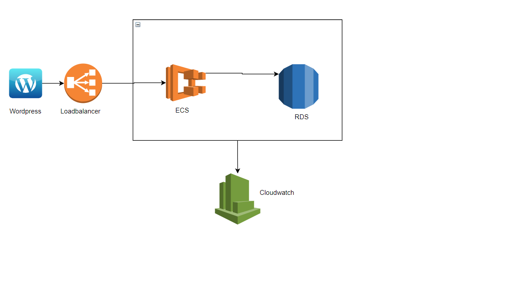

# terraform-aws-wordpress-ecs

Terraform module which deploys Wordpress on AWS using ECS Fargate for compute, RDS for database and an application load balancer. RDS credentials are saved in the Secretmanager for security.

## Example Usage
1- Make sure you have aws cli installed

2- Make sure you give the profile name (if its other then default) in `provider.tf`

`profile= ""`

3- Run the following commands to create the infra:
```
terraform init
terraform plan
terraform apply
```

## Architecture Diagram
